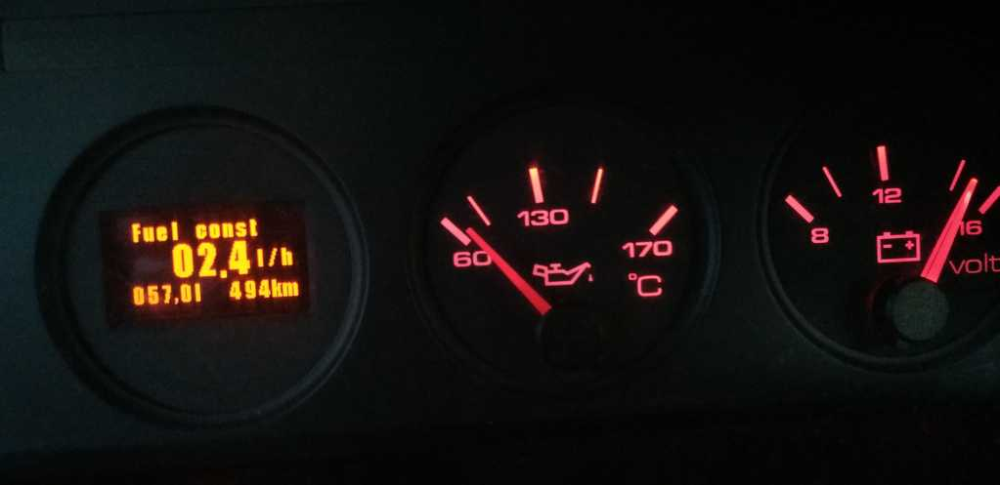
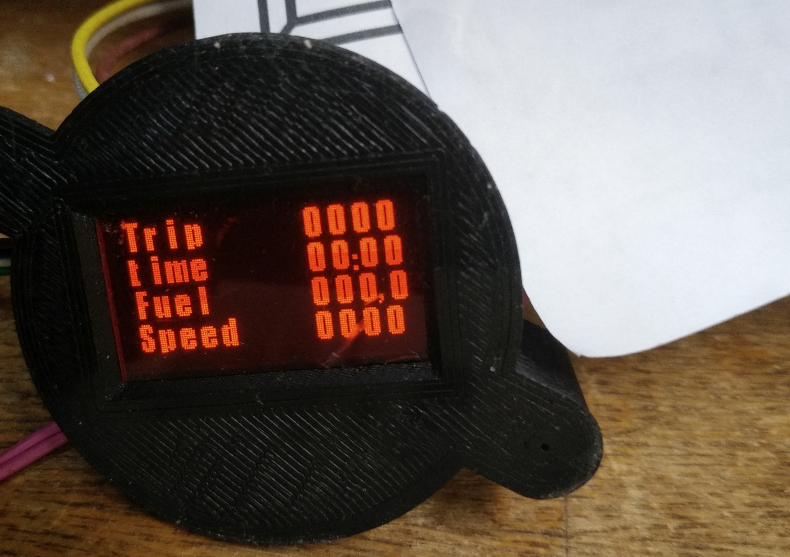
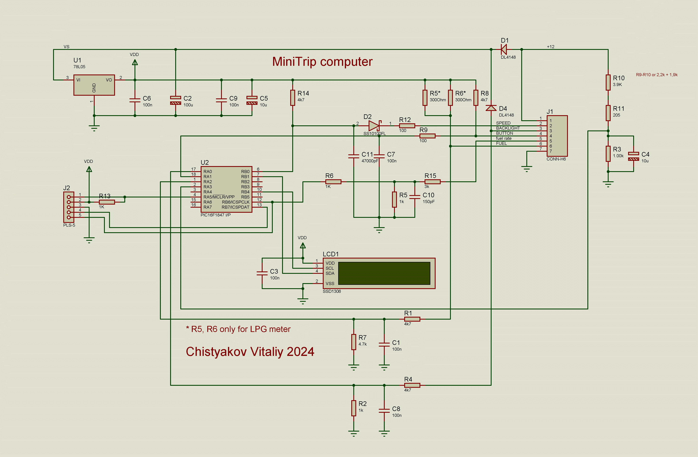

# MiniTrip
Miniature trip computer for Audi 80/100/200/A6C4 on PIC16F1847 with display SH1109/SSD1306/SSD1309 OLED controllers 128x64 pixel

Main feutures:
- fuel consumption;
- speedometer;
- odometer;
- hour counter;
- on-board voltage;
- fuel level.

Testing on Audi A6/100 C4 with Digifant ECU ABK motor and AAD Motronic.

Fuel level sensor

|Fuel	|	Voltage|
|-----	|------		|
|12L	| 	- 2,4v|
|20L	|	- 3,0v|
|40L	|	 - 3,8v|
|60L	|	 - 4,5v|
|80L	|	 - 5,5v|

Project create in MPLAB IDE v8.92 from Mictochip and XC8 Compiler
